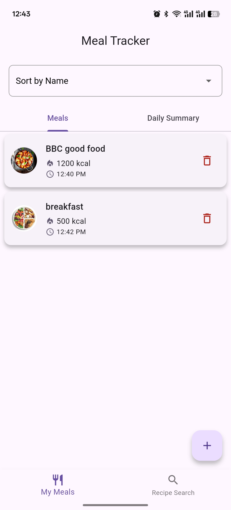
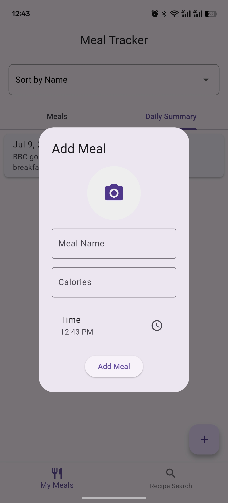
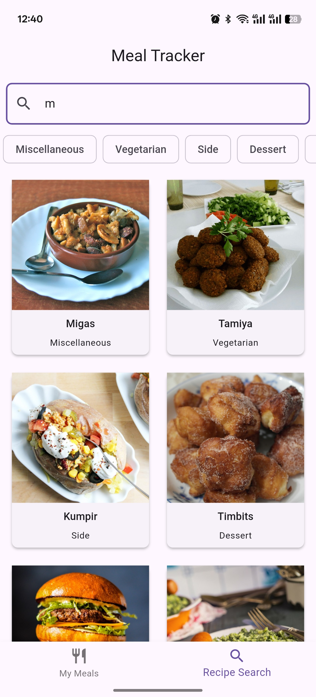

# 🍽️ MealTracker

A modern Flutter app to **search, track, and save meals** using [TheMealDB API](https://www.themealdb.com/). Designed with a dark theme and built using **Flutter + Dart**, this app helps users manage their meals with calorie tracking and intuitive UI.

---

## 📱 Features

- 🔍 **Search meals by name** using TheMealDB API
- 📂 **Filter meals by category** (e.g., Seafood, Beef, Vegetarian)
- 🧾 **View full meal details**, including ingredients and instructions
- ❤️ **Add & delete meals** to a local favorites list
- 🗂️ **Save meals locally using SQLite**
- 🍴 **Track total calories** per saved meal
- 🔁 **Sort meals** by name, calories, or preparation time
- 🌓 **Dark mode UI** with Material 3 design
- 📲 **Bottom navigation bar** for Home & Search screens
- 💾 **Persistent data** across sessions

---

## 📸 Screenshots
<--




-->

---
---
📂 Project Structure
```bash
lib/
├── core/
├── data/
│   ├── models/
│   └── services/
├── presentation/
│   ├── pages/
│   └── widgets/
├── provider/
└── main.dart

```


---
## 🛠️ Technologies Used

- **Flutter** (UI framework)
- **Dart** (language)
- **SQLite** (local database)
- **Provider** (state management)
- **TheMealDB API** (data source)

---

## 🚀 Getting Started

### 1. Clone the repository

```bash
git clone https://github.com/Omar-galab/MealTracker.git
cd MealTracker
